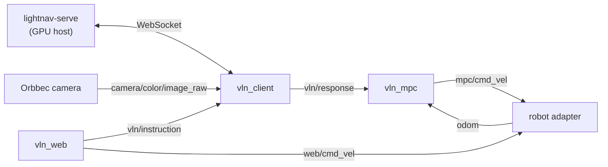

# robot_deploy

The on-robot half of LightNav deployment: a ROS 2 workspace that connects a
camera, the [`lightnav-serve`](../docs/DEPLOYMENT.md) WebSocket server, an MPC
tracker, and a robot base — with a web control panel on top. Adapters for the
Unitree Go2 and LimX TRON1 are included; adding a robot means writing one adapter
package ([Bring your own robot](#bring-your-own-robot)).

```text
robot_deploy/
├── README.md
├── scripts/           # build.sh
└── src/
    ├── vln_client/    # camera → lightnav-serve WebSocket client
    ├── vln_mpc/       # waypoint alignment + tracking MPC
    ├── vln_web/       # web control panel (port 8088)
    ├── vln_bringup/   # launch files: tron / go2
    └── robot_adapters/
        ├── go2_adapter/   # Unitree Go2 (unitree_sdk2py)
        └── tron_adapter/  # LimX TRON1 (WebSocket protocol)
```

## Architecture



There is no external mux: the adapter subscribes to both `web/cmd_vel` (manual
WASD) and `mpc/cmd_vel` (autonomous) and arbitrates between them by control
source, publishing the active source on `control/source`. Stopping, the command
watchdog, and hand-back to the robot's own remote are the adapter's
responsibility.

The model itself runs elsewhere, on a GPU host behind `lightnav-serve` — the
robot needs no GPU. See [docs/DEPLOYMENT.md](../docs/DEPLOYMENT.md) for the
server side and the wire protocol. To try this stack without a robot,
[`mujoco_demo/`](../mujoco_demo/README.md) runs the same MPC and client
protocol against a simulated TurtleBot.

## From a fresh machine

Tested on Ubuntu 22.04 with ROS 2 Humble.

1. Install [ROS 2 Humble](https://docs.ros.org/en/humble/Installation.html)
   and `python3-colcon-common-extensions` + `python3-rosdep`.

2. Resolve the ROS dependencies (message packages, the Orbbec camera driver,
   and the apt-packaged Python deps) with rosdep:

   ```bash
   cd robot_deploy
   sudo rosdep init        # first time on this machine only
   rosdep update
   rosdep install --from-paths src --ignore-src -y
   ```

3. Install CasADi for `vln_mpc` — it has no apt/rosdep package, so this one is
   manual:

   ```bash
   pip install "casadi>=3.7,<4"
   ```

4. **Go2 only:** install Unitree's official
   [`unitree_sdk2_python`](https://github.com/unitreerobotics/unitree_sdk2_python)
   and the CycloneDDS 0.10.2 it requires — see
   [go2_adapter/README.md](src/robot_adapters/go2_adapter/README.md).

5. Build and source:

   ```bash
   ./scripts/build.sh
   source install/setup.bash
   ```

6. Start the stack for your robot (below), open `http://<robot-ip>:8088`, set
   the VLN server URL to your `lightnav-serve` address, type an instruction,
   and press **Start VLN**.

## Running

### LimX TRON1

```bash
ros2 launch vln_bringup tron.launch.py
```

The adapter connects to the robot at `ws://10.192.1.2:5000` (TRON1's documented
address); override with the `robot_url` parameter if yours differs.

### Unitree Go2

```bash
ros2 launch vln_bringup go2.launch.py network_interface:=eth0
```

`network_interface` is the interface wired to the Go2 (default `enP8p1s0`).

Both launch files also start the Orbbec Gemini 330 driver (color-only,
640×360@30). Any camera works as long as an `rgb8` image reaches
`camera/color/image_raw` — remap or set `vln_client`'s `image_topic` /
`image_transport` (`raw` or `compressed`) parameters and drop the Orbbec
include from the launch file.

## Web panel

`vln_web` serves a single-page panel on port `8088`: live camera preview with
the predicted trajectory overlaid, VLN start/stop and task mode
(Track / ObjNav), VLN server URL switching, robot status and mode buttons,
WASD manual driving, hot reload of the MPC and WASD limits, command/odometry
velocity charts, and Wi-Fi switching for the onboard computer (via `nmcli`).

## Packages

- **`vln_client`** — subscribes to the camera, talks to `lightnav-serve`, and
  publishes the inference response, status, and a visualization path.
- **`vln_mpc`** — aligns waypoints to `odom` at image-capture time and tracks
  them with a CasADi MPC at 10 Hz, publishing `mpc/cmd_vel`.
- **`vln_web`** — the web panel above.
- **`vln_bringup`** — launch files composing camera + client + MPC + web +
  adapter per robot.
- **`go2_adapter` / `tron_adapter`** — translate the common interface below to
  each robot's native API.

Each package README documents its full topic/parameter interface.

## Bring your own robot

Write one ROS 2 package that speaks the common interface, then copy
`tron.launch.py` and swap in your adapter:

Subscribe:

- `web/cmd_vel`, `mpc/cmd_vel` (`geometry_msgs/TwistStamped`) — arbitrate by
  control source; forward the active one to your base.

Publish:

- `odom` (`nav_msgs/Odometry`) — `odom` → `base_link`, with real timestamps
  (the MPC aligns waypoints against this history).
- `diagnostics` (`diagnostic_msgs/DiagnosticArray`) — connection, mode,
  battery, IMU, motor status for the web panel.
- `control/source` (`std_msgs/String`) — `disabled`, `manual`, or `auto`.
- `robot/events` (`std_msgs/String`) — free-form event log.

Services (`std_srvs/Trigger`):

- `control/set_manual`, `control/set_auto`, `control/stop`
- `robot/stand`, `robot/walk`, `robot/sit`, `robot/emergency_stop`

Safety expectations: the adapter owns the command watchdog (stop if commands
go stale — `tron_adapter` uses 0.35 s and sends a burst of zero-velocity
frames), the stop behavior, and returning control to the robot's own remote
when the source is `disabled`. `tron_adapter` (WebSocket robot) and
`go2_adapter` (vendor SDK robot) are the two reference implementations.
